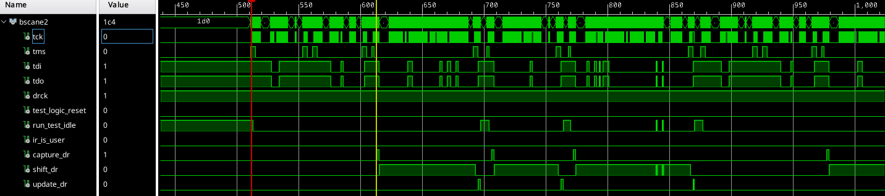

# BSCANE2 Waveforms

The BSCANE2 documentation comes a bit short on describing the behavior of the output signals as well as on the requirements of the input signal `tdo`. This repository contains a FPGA design which captures in detail this behavior and tests the timings of `tdo`.

The description of this primitive in the user-guide UG470 is a touch light:

>  A signal on the TDO input of the primitive passes through an output timing register, where the TDO input to the primitive is registered on the falling edge of TCK as it is passed to the external TDO output pin when a USER instruction is active. The associated primitive's SEL output goes High to indicate which USER1-USER4 instruction is active. The DRCK output provides access to the data register clock generated by the TAP controller. The RESET, UPDATE, SHIFT, and CAPTURE pins represent the decoding of the corresponding state of the boundary scan internal state machine. The TDI port provides access from the external TDI pin of the JTAG TAP in order to shift data into an internal scan chain. The TCK and TMS pins are similarly monitored through the BSCANE2 primitive.

| BSCANE2 Port | Signal Name        | Description(1) (Xilinx)      | Remarks   |
|--------------|--------------------|------------------------------|-----------|
| TCK          | `tck`              | Output from external TAP pin | Confirmed |
| TMS          | `tms`              | Output from external TAP pin | Confirmed |
| TDI          | `tdi`              | Output from external TAP pin | Xilinx's description is somewhat misleading since the TDI is connected to the `tdo` output of the ARM DAP and not to the `tdi` package pin |
| TDO          | `tdo`              | Input to a flip-flop that registers the primitive input on the falling edge of TCK | Didn't find timing details on this input |
| SEL          | `ir_is_user`       | Asserted when IR matches USERx | Confirmed |
| DRCK         | `drck`             | Gated TCK output when SEL is asserted, DRCK toggles when CAPTURE or SHIFT are asserted | To be checked |
| RESET        | `test_logic_reset` | TAP controller is in Test-Logic-Reset state | Not confirmed |
| RUNTEST      | `run_test_idle`    | TAP controller is in Run-Test/Idle state | Confirmed |
| CAPTURE      | `capture_dr`       | TAP controller is in Capture-DR state | Confirmed |
| SHIFT        | `shift_dr`         | TAP controller is in Shift-DR state | Confirmed |
| UPDATE       | `update_dr`        | TAP controller is in Update-DR state | Confirmed |

(1) Reworded for conciseness.

After powerup:


The following shows activity on the JTAG interface (likely from an ILA capture running in background). Noticed that although `ir_is_user` is low there is activity on all other signals expect `drck`.



# Lessons Learnt

- Always check that the BSCANE2 instance is selected by ensuring its `SEL` output is asserted.
  - All JTAG and TAP FSM state signals are driven regardless of the instruction register (IR) values.
  - Designs relying on the BSCANE2 outputs without checking the value of `SEL` may experience undefined behavior.

# Usage

```
make
```
